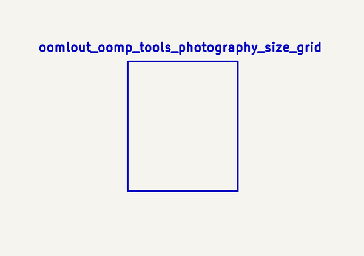
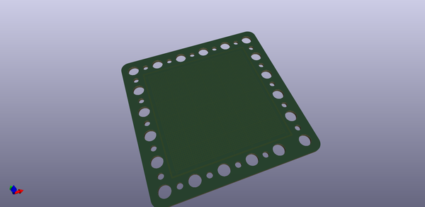
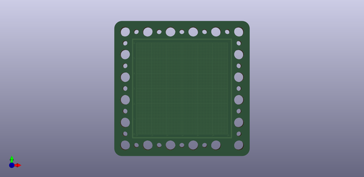
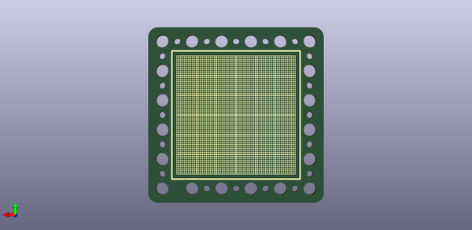
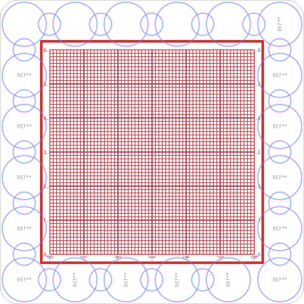
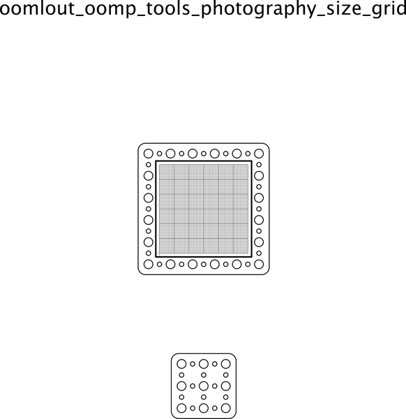

# OOMP Tools Photography Size Grid
OOMP Tools Photography Size Grid  
A grid for reference in photos.  
* ibom github: [ibom github](kicad/current_version/working/bom/ibom.html)
* ibom direct: [ibom direct](https://raw.githack.com/oomlout/oomlout_oomp_tools_photography_size_grid/main/kicad/current_version/working/bom/ibom.html)

## schematic  
  
[schematic (pdf)](kicad/current_version/working/working_schematic.pdf)  

## pcb  
  
    
  
  
[board (pdf)](kicad/current_version/working/working.pdf)  

## corel working
 

## oomp_parts_summary
no data
Search Links: (L) - lcsc, (D) - digikey, (M) - mouser, (N) - newark, (SZ) - szlcsc
note: a work on progress that takes the bom file from kicad pcb and try's to add oomp details

